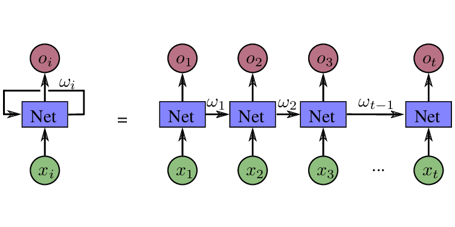
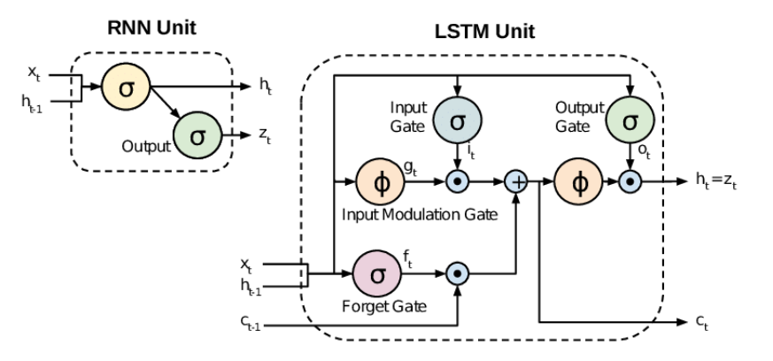

# A simple RNN 

## Overview 
A very simple RNN/ LSTM used to predict the target language of the input name or for text generation 

Ex for name predicton : "Peter" -> "Russian" 

## Architecture 

For the RNN : 

For the LSTM : 

